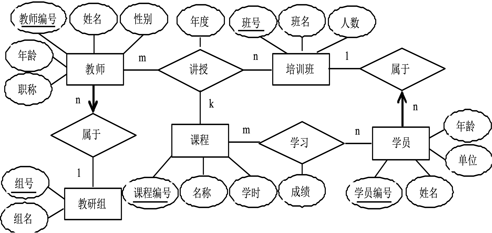
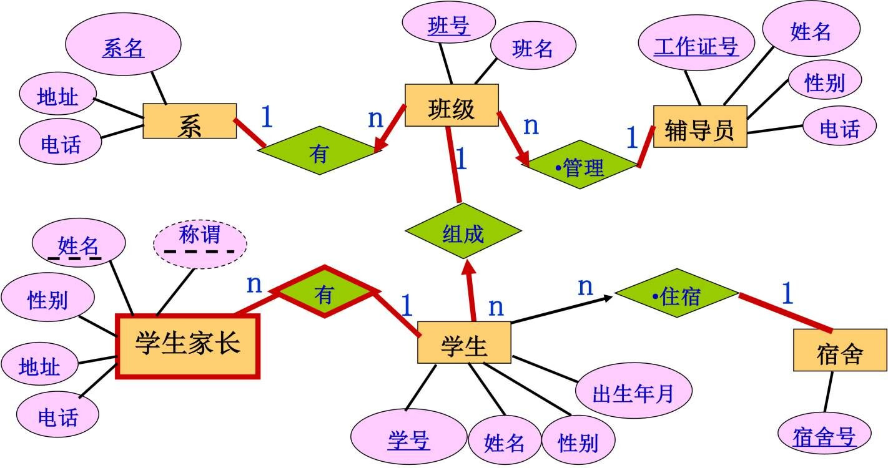
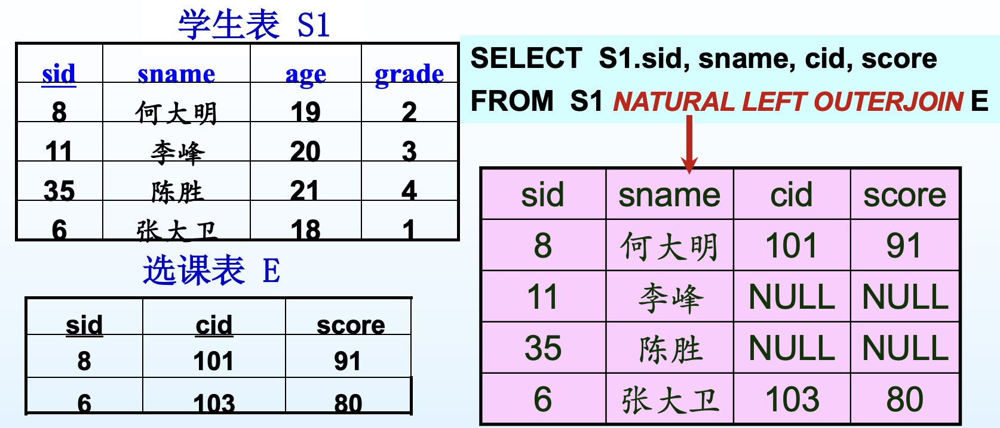
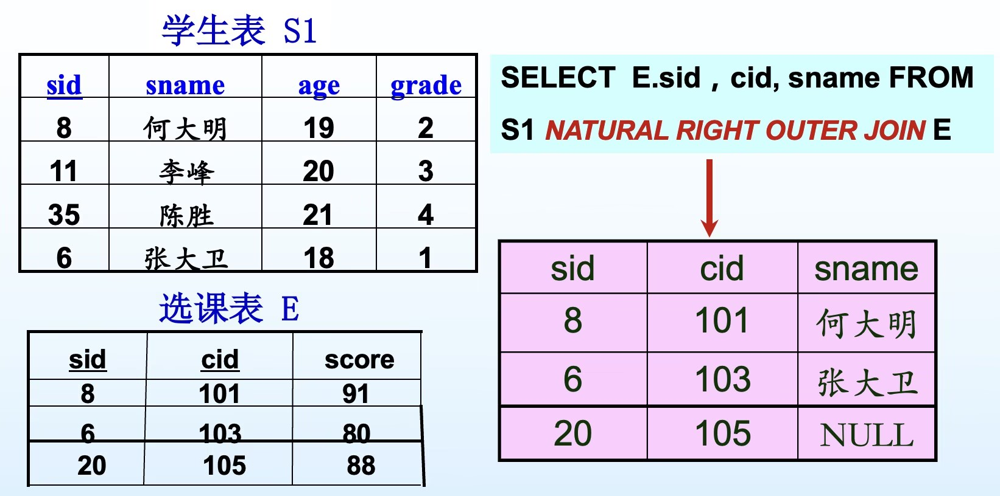
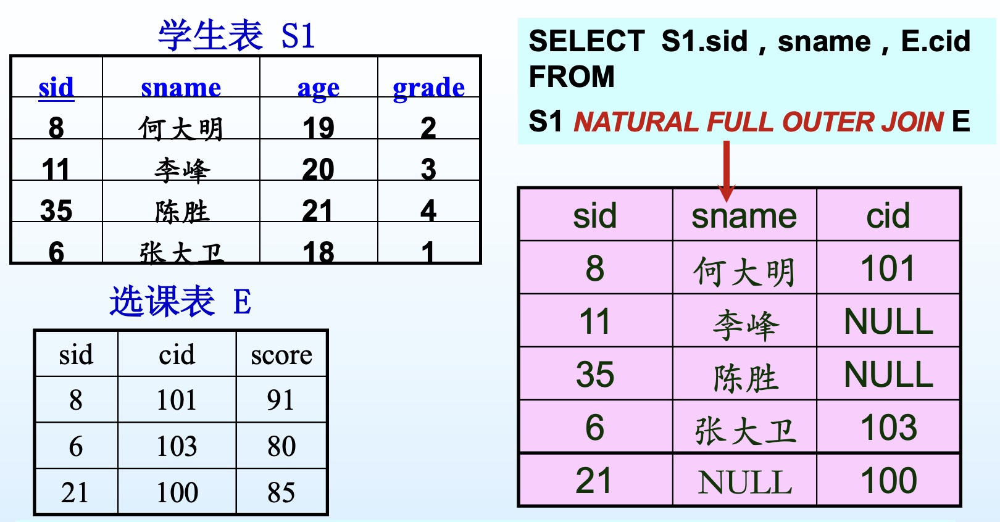

# Ch03 关系数据模型

---

#### 1.关系数据模型的数据结构

>1. 关系模型用关系来表达数据结构
>   - 关系(relation)：描述数据本身、数据之间的联系，俗称“表”。
>   - 列（column）：又称“字段”（field），“属性”（attribute），“成员”（member），“数据项”。
>   - 行（row）：又称“元组”（tuple），“记录”（record）。
>   - 域（domain）：列的取值范围。
>   - 关系模式（schema）：由关系名和各列名组成，其描述的一般形式为：$R(A_1,A_2,...,A_n)$，其中,R为关系名，$A_i(i=1,2,...,n)$为关系$R$的属性，例如，学生模式可表示如下：学生（学号，姓名，性别，专业）。
>2. 关系是一种规范化了的二维表，有如下性质：
>   - 每一个属性值都不可分解
>   - 不可出现重复元组
>   - 行无序
>   - 列有序

#### 2.关系模型的完整性约束

>1. 关系模型中可被指定的完整性约束，包括域约束（domain constraint）、主键约束（primary key constraint）、唯一约束（unique constraint）、外键约束（foreign key constraint）、一般性约束（general constraint）。
>2. 完整性约束包括三大类：实体完整性、参照完整性、用户定义完整性。
>3. 域约束————对于数据类型的约束。
>4. 主键约束————值唯一且不为空。
>5. 唯一约束（针对候选键）————值唯一，可以有0个或1个空值。
>6. 外键约束————其中一张表的某个属性在另一张表中作主键。
>   - 外键作主键的表称为主表，另一张表称为从表。
>   - 外键可以在两张表中都作主键。
>   - 外键约束需要从两个方向维护表间数据完整型：
>     - 主表->从表：主表中的主键值的修改和删除。解决：```主表NO ACTION```或```从表CASCADE```
>     - 从表->主表：从表中的外键值的插入和修改。解决；从表外键值```REFERENCE```主表主键值
>   - 表间数据完整性的维护：
>     - 利用外键约束定义（FOREIGN KEY CONSTRAINT）
>     - 利用触发器（TRIGGER）
>     - 断言限制（ASSERTION）
>7. 用户自定义完整性，最常见的时限定属性的取值范围，如：NOT NULL, CHECK IN()

#### 3.SQL Server完整性验证

>1. 定义数据结构
>
>   - 整型：BIGINT、INT、SMALLINT、TINYINT.
>   - 浮点型：DECIMAL、REAL、FLOAT. DECIMAL的语法：DECIMAL(p, s)，其中p表示数字精度，s表示小数位数，p取值范围是[1,38]，缺省值是18，s取值范围是[0, p].
>   - 字符型：CHAR、VARCHAR、TEXT、NCHAR、NVARCHAR、NTEXT. 
>   - 日期和时间型：
>     - DATETIME，格式：```YYYY-MM-DD hh:mm:ss```
>     - SMALLDATETIME，格式：```YYYY-MM-DD hh:mm:ss```
>     - DATE，格式：```YYYY-MM-DD```
>     - TIME，格式：```hh:mm:ss```
>   - 货币型：MONEY、SMALLMONEY
>   - 位数据型：只取0或1
>
>2. 常用的日期处理函数: 
>
>   - ```DateDiff(interval, date1, date2)```，返回date2-date1，以interval指定的形式。
>     - ```DateDiff('d'),'2020-5-14','2020-5-18 17:50:30')```，返回值为4
>   - ```GetDate```，返回系统当前的日期与时间。
>   - ```DatePart(interval, date)```，返回date中，interval指定部分的整数值
>     - ```DatePart('w', '2020-5-14')```，返回5（周四）
>     - ```DatePart('d', '2020-5-14')```，返回14
>     - ```DatePart('yyyy', '2020-5-14')```，返回2020
>
>3. 常用的字符串处理函数：
>
>   - ```LEFT(character_expression, integer_expression)```,返回从字符串左边起的指定个数个字符
>     - ```LEFT('I_wanted_you', 5)```，返回：I_wan
>   - ```RIGHT(character_expression, integer_expression)```,返回从字符串右边起的指定个数个字符
>     - ```RIGHT('I_wanted_you', 5)```，返回：d_you
>   - ```SUBSTRING(character_expression, start, length)```，返回从start开始的length个字符，字符串下标从1开始
>     - ```SUBSTRING("I_wanted_you", 3, 6)```，返回：wanted
>   - ```CONVERT(int, string)```，将字符串string转换成int型
>
>4. 设置缺省值
>
>   - 表定义时设置
>
>     ```sql
>     CREATE TABLE Publishers(
>     	pub_id CHAR(4) PRIMARY KEY,
>         pub_name VARCHAR(40) NOT NULL,
>         city VARCHAR(20) DEFAULT 'San Francisco',
>         state VARCHAR(20) DEFAULT 'Califonia'
>     )
>     ```
>
>   - 单独的命令设置
>
>     创建：```CREATE DEFAULT 缺省名 AS '默认值'```
>
>     绑定：```sp_bindefault '缺省名'，'表名.属性'```
>
>     ```sql
>     CREATE DEFAULT dft_state AS 'Califonia'
>     sp_bindefault 'dft_state', 'publishers.state'
>     ```
>
>     删除：先取消绑定：```sp_unbindefault '表名.属性'```,
>
>     ​     后删除缺省：```DROP DEFAULT 缺省名```
>
>5. 设置RULE：与设置缺省值类似，```sp_bindefault```->```sp_bindrule```，规则用IN、BETWEEN...AND...，关系式(<, >, <=, >=, < >, =, !=, !>, !<, LIKE)来描述
>
>   ```sql
>   CREATE RULE state_rules AS @state IN('Califonia', 'LAL')
>   ```
>
>   创建规则时，AS以后有一个@开头的临时变量
>
>4. 检查约束：
>
>   ```sql
>   CREATE TABLE Employee(
>   	id INT PRIMARY KEY,
>       name VARCHAR(10),
>       dept_No, INT
>       CONSTRAINT dep_constraint CHECK(dept_No BETWEEN 10 AND 100),
>       job VARCHAR(10)
>       CONSTRAINT job_constraint CHECK(job IN('Sales', 'Manager'))
>   )
>   ```
>
>5. 主键约束，在主键后写上```PRIMARY KEY```. 若联合主键，两属性不能同时相同。
>
>6. 唯一约束，在候选键后写上```UNIQUE```
>
>7. 外键约束
>
>   ```sql
>   // Ctake为关系表
>   CREATE TABLE Ctake(
>   	CID CHAR(10) NOT NULL,
>       SID CHAR(10) NOT NULL,
>       CONSTRAINT CID_constraint FOREIGN KEY (CID) REFERENCES Course(CID)
>       	ON DELETE CASCADE	/*CASCADE，针对从表的策略*/
>       	ON UPDATE CASCADE,
>       CONSTRAINT SID_constraint FOREIGN KEY (SID) REFERENCES Student(SID)
>       	ON DELETE NO ACTION	/*NO ACTION，针对主表的策略*/
>       	ON UPDATE NO ACTION,
>       PRIMARY KEY(CID, SID)
>   )
>   ```
>
>8. 触发器
>
>   ```sql
>   //由删除操作触发的主表删除触发器示例
>   CREATE TRIGGER pub_del
>   	ON Publishers
>   	AFTER DELETE
>   	AS
>   		IF @@rowcount=0 RETURN	/*@@rowcount是系统变量，指示表中有几行被删除了*/
>   		DELETE titles 	/*FROM指明要引用的表*/
>               FROM titles t, deleted d	/*t,d分别是titles和deleted的别名*/
>               WHERE t.pub_id=d.pub_id
>   	RETURN
>   	
>   /*----------------------------------------------------------------------*/
>   
>   //由修改操作触发的主表修改触发器
>   CREATE TRIGGER pub_update
>   	ON Publishers
>   	AFTER UPDATE
>   	AS
>   		IF @@rowcount=0 RETURN
>   		IF UPDATE(pub_id)
>   		BEGIN
>   			UPDATE titles SET pub_id=i.pub_id 
>   				FROM titles t, deleted d, inserted i
>   				WHERE t.pub_id=d.pub_id
>   		END
>   	RETURN
>   	
>   /*----------------------------------------------------------------------*/
>   
>   //由修改和插入操作触发的从表触发器
>   CREATE TRIGGER title_ui
>   	ON titles
>   	AFTER INSERT, UPDATE
>   	AS
>   		IF @@rowcount=0 RETURN
>   		IF (SELECT COUNT(*)
>              	FROM publishers p, inserted i
>              	WHERE p.pub_id=i.pub_id)=0
>           BEGIN
>           	RAISERROR 53334 '试图插入或修改非法的pub_id值'
>           	ROLLBACK TRANSACTION	//回退事务，即不执行操作和触发器
>           	RETURN
>           END
>       RETURN
>   ```
>
>9. 数据库完整性约束的建立使用DBMS的```数据定义语言```。
>10. 限制输入到一列或多列值的范围使用```CHECK```约束。
>11. DBMS系统使用```完整性约束```防止用户的非法数据进入数据库。
>12. 删除表中的主键，外键约束的处理方案可以是：让主表```NO ACTION```

#### 4.实体联系模型向关系模型的转换

>1. 若联系有属性，将联系转换为表，联系的描述属性与参与联系的各实体的主键作为表的列，各实体的主键各自作为表的外键。表的主键确定方法如下：
>   - 1: 1联系：任选一方实体的主键作为表的主键，其他实体的主键作为候选键
>   - 1: n联系：将n的一方（即带有键约束的一方）实体的主键作为表的主键
>   - m: n联系：参与的各实体的主键联合作为表的主键
>2. 若联系不带有属性，按照以下方法处理：
>   - 1: 1联系：不转换为表，将联系涉及的实体转移到任意带有键约束的实体转换的表中，并作为该表的外键和候选键
>   - 1: n联系：不转换为表，将联系涉及的实体转移到带有键约束的实体转换的表中，并作为该表的外键
>   - m: n联系：转换为表，联系的描述属性与参与联系的各实体的主键作为表的列，各实体的主键各自作为表的外键，参与的各实体的主键联合作为表的主键
>3. 对于弱实体和识别联系，弱实体可直接转换为表，并将弱实体的主键增加到此表中。表的主键由识别实体的主键和弱实体的部分键共同构成，识别实体的主键作为该表的外键。
>
>例：将下列ER图转换为关系模型
>
>
>
>解：
>
>>​	教研组（<u>组号</u>，组名）。
>>​	培训班（<u>班号</u>，班名，人数）。
>>​	教师（<u>教师编号</u>，姓名，性别，年龄，职称，组号），组号为外键。
>>​	学员（<u>学员编号</u>，姓名，年龄，单位，班号），班号为外键。
>>​	课程（<u>课程编号</u>，名称，学时）。
>>​	讲授（<u>教师编号，班号，课程编号</u>，年度），教师编号、班号和课程编号均各为外键。
>>​	学习（<u>课程编号，学员编号</u>，成绩），课程编号和学员编号均各为外键。
>
>例：将下列ER图转换为关系模型
>
>
>
>解；
>
>>系（<u>系名</u>，地址，电话）。
>>班级（<u>班号</u>，班名，系名，工作证号），系名，工作证号为外键。
>>辅导员（<u>工作证号</u>，姓名，性别，电话）。
>>学生（<u>学号</u>，姓名，性别，出生年月，班号，宿舍号），班号，宿舍号为外键。
>>宿舍（<u>宿舍号</u>，宿舍名，地址）。
>>学生家长（<u>学号，称谓，姓名</u>，性别，地址，电话），学号为外键。
>>
>>```sql
>>CREATE TABLE  depart
>>    (dname      VARCHAR(20) 	PRIMARY KEY,
>>     dadrress	VARCHAR(40)	NOT NULL,
>>     dtel  CHAR(11) CHECK(dtel LIKE '[0-9][0-9][0-9][0-9][0-9][0-9][0-9][0-9][0-9][0-9][0-9]'))
>>     
>>CREATE TABLE  assistent
>>    (aID    INT identity(1,1) 	PRIMARY KEY,
>>     aname  CHAR(10)	NOT NULL,
>>     asex 	CHAR(1) 	NOT NULL,
>>     atel   CHAR(11) CHECK(atel like '[0-9][0-9][0-9][0-9][0-9][0-9][0-9][0-9][0-9][0-9][0-9]'))
>>     
>>CREATE TABLE  classes
>>    (cno    INT identity(1,1) 	PRIMARY KEY,
>>     cname  VARCHAR(20)	NOT NULL,
>>     dname  VARCHAR(20) FOREIGN KEY REFERENCES depart(dname),
>>     aID    INT  FOREIGN KEY REFERENCES assistent(aID))     
>>
>>CREATE TABLE  dorm
>>    (dno    CHAR(4) PRIMARY KEY,
>>     dname 	VARCHAR(20)	NOT NULL,
>>     daddr  VARCHAR(40) NOT NULL)     
>>     
>>CREATE TABLE  students
>>    (Sno    INT IDENTITY(1,1) 	PRIMARY KEY,
>>     Sname 	VARCHAR(20)	NOT NULL,
>>     Ssex  	CHAR(1) CHECK( Ssex in ('F','M')),
>>     Sbirth CHAR(10) NOT NULL,
>>     cno  	INT  FOREIGN KEY REFERENCES classes(cno),
>>     dno 	CHAR(4) FOREIGN KEY REFERENCES dorm(dno))      
>>
>>
>>CREATE TABLE  parents
>>    (Sno    INT  FOREIGN KEY REFERENCES students(Sno) ,
>>     title 	CHAR(10) NOT NULL,
>>     pname  CHAR(10) NOT NULL,
>>     paddr 	VARCHAR(30) NOT NULL,
>>     ptele 	CHAR(11) NOT NULL,
>>     PRIMARY KEY(Sno,title,pname))      
>>```

#### 5.关系代数

>1. 基本操作代数：选择、投影、并、差、笛卡尔积。（交可由差运算得到）
>
>2. 对于关系代数和关系运算，如果结果中有重复的元组，会删重。在DBMS中会保留（删重开销很大）。
>
>3. 选择，操作符为$\sigma_c$，其中c表示条件（condition）表达式，常用的比较操作符有>, >=, <, <=, =, !=（不连写，暂时没找到怎么取消JetBrains连写的操作）, < >（同!=）。在关系表达式中用与、或、非表示，在关系代数和关系运算中用$\land$,$\vee$,$\neg$，在SQL中用AND，OR，NOT.
>
>   $\sigma_{CID='计算机2021-01'\land SName='tst'}(Student)$
>
>   对应的SQL语句：
>
>   ```sql
>   SELECT * FROM Student 
>   	WHERE CID='计算机2021-01' AND SName='tst'
>   ```
>
>3. 投影，操作符为$\pi_{attribute\_list}$，attribute_list表示要投影出的列。选择与投影常联合使用。
>
>   $\pi_{CID,CName}(\sigma_{credit>=3}(Course))$
>
>   对应的SQL语句：
>
>   ```sql
>   SELECT CID, CName FROM Course
>   	WHERE creidt>=3
>   ```
>
>4. 选择————从表中选出满足某种条件的元组的操作。
>
>   投影运算————去除关系中的某些列，并消去重复元组的关系代数运算。
>
>5. 集合操作
>
>   - 并。$R\cup S$，前提是R与S关系模式兼容，列的个数相同，对应列的类型相同，对应列的列名不一定相同。
>
>     ```sql
>     SELECT * FROM R
>     UNION
>     SELECT * FROM S
>     ```
>
>   - 交。$R\cap S$，前提是R与S关系模式兼容，列的个数相同，对应列的类型相同，对应列的列名不一定相同。
>
>     ```sql
>     SELECT * FROM R
>     INTERSECT
>     SELECT * FROM S
>     ```
>
>   - 差。$R-S$，前提是R与S关系模式兼容，列的个数相同，对应列的类型相同，对应列的列名不一定相同。
>
>     ```sql
>     SELECT * FROM R
>     EXCEPT
>     SELECT * FROM S
>     ```
>
>     交运算由差运算得到：$R\cap S=R-(R-S)$.
>
>   - 笛卡尔积。$R\times S$，若R有M个属性p个元组，S有N个属性q个元组,则$R\times S$有M+N个属性，p×q个元组。
>
>     如果有相同的列名，则在结果字段中不命中，只用位置表示。
>
>     对应的SQL:
>
>     ```sql
>     SELECT S.SID, S.SName, S.SAge, S.SGrade, E.SID, E.CID, 
>     	FROM S, E
>     ```
>
>     用'.'表示实体的属性限定
>
>     $\pi_{sid,sname,cid,score}(\sigma_{S.sid=E.sid}(S\times E))$
>
>     对应的SQL:
>
>     ```sql
>     SELECT S.sid,S.sname,E.cid, E.score
>     	FROM S, E
>     	WHERE S.sid=E.sid
>     ```
>
>6. 关系代数中的$\pi$对应```SELECT...```语句中的子句```SELECT```
>
>7. 广义笛卡尔积不属于专门的关系运算（选择、投影、连接属于）。
>
>8. 设关系R和S的结构相同，且各有100个元组，则这两个关系的并操作后，结果的元组个数为```<=200```
>
>9. 除操作：$R\div S$
>
>   关系R:
>
>   | sid  | cid  |
>   | :--: | ---- |
>   |  3   | 101  |
>   |  3   | 102  |
>   |  3   | 103  |
>   |  3   | 104  |
>   |  5   | 101  |
>   |  5   | 102  |
>   |  8   | 102  |
>   |  10  | 102  |
>   |  10  | 104  |
>
>   S1:
>
>   | cid  |
>   | :--: |
>   | 102  |
>
>   $R\div S1$:
>
>   | sid  |
>   | :--: |
>   |  3   |
>   |  5   |
>   |  8   |
>   |  10  |
>
>   S2:
>
>   | cid  |
>   | :--: |
>   | 102  |
>   | 104  |
>
>   $R\div S2$:
>
>   | sid  |
>   | :--: |
>   |  3   |
>   |  10  |
>
>10. 条件联结，$R\Join _cS = \sigma_c(R\times S)$
>
>    $S\Join _{S.sid<E.sid}E$
>
>    对应的SQL：
>
>    ```sql
>    SELECT S.sid, S.SName, S.Age, S.Grade, E.sid, E.cid, E.score
>    	FROM S CROSS JOIN E
>    	WHERE S.sid<E.sid
>    	
>    //下面这种写法同上面等价
>    SELECT S.sid, S.SName, S.Age, S.Grade, E.sid, E.cid, E.score
>    	FROM S, E
>    	WHERE S.sid<E.sid
>    ```
>
>11. 等联结，是条件联结的特例，要求条件由等式组成。
>
>    $S\Join _{S.sid=E.sid}E$
>
>    对应的SQL：
>
>    ```sql
>    SELECT S.sid, S.SName, S.Age, S.Grade, E.sid, E.cid, E.score
>    	FROM S, E
>    	WHERE S.sid=E.sid
>    ```
>
>12. 自然联结，是等联结的特例，要求等式中涉及的字段名也必须相同。此时，可省略联结条件不写。
>
>    $S\Join E$
>
>    对应的SQL：
>
>    ```sql
>    SELECT S.sid, S.SName, S.Age, S.Grade, E.sid, E.cid, E.score
>    	FROM S NATURAL JOIN E
>    	
>    //下面这种写法同上面等价
>    SELECT S.sid, S.SName, S.Age, S.Grade, E.sid, E.cid, E.score
>    	FROM S, E
>    	WHERE S.sid=E.sid
>    ```
>
>13. 外联结，自然连接的特例（前三种联结属于“内联结”）。如果两张表的某字段，但是不存在值相等的对应行，自然联结不会显示该行，但是外连接会以NULL值显示该行。也就是保留所有出现的字段名相同的行，若在另一张表中没有某字段，以NULL显示。
>
>    - 左外联结示例：
>
>      
>
>      图中SQL语句有误，应是：
>
>      ```sql
>      SELECT S1.sid,sname,E.cid,score
>      	FROM S1 NATURAL LEFT OUTER JOIN E
>      	ON S1.sid=E.sid		/*SQL Sever要求联结的条件通过ON引出*/
>      ```
>
>    - 右外联结示例：
>
>      
>
>      同样地，需要加上```ON S1.sid=E.sid```
>
>    - 全外联结示例：
>
>      
>
>      You should know what I mean.